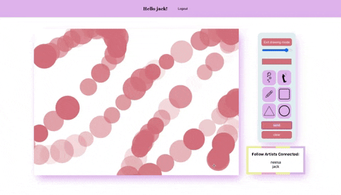

# Lukis-Lukis

Lukis-lukis is a webapp for that allows two or more friends to draw on one canvas together.

## Motivation

I wanted to build an app where friends can hang out and do activities together without having to leave their house, which is appropriate for this unprecedented time of worldwide pandemic. I have a passion for drawing so decided to create an application where people can create art together and see each others work in real time.

## Screenshot




## Dependencies

- Node Js (v10 and above)
- Mongo DB

## Technologies

- [Node js](https://nodejs.org/)
- [Socket.io](https://socket.io/)
- [Fabric.js](http://fabricjs.com/)
- [Mongoose](https://mongoosejs.com/)
- [Express](https://expressjs.com/)
- [React](https://reactjs.org/)

## Installation

Run the command below:
```bash
npm install
```

## Starting the application

Before starting the app, make sure MongoDB is running.

To run the application in development you will need to start three servers like so

```bash
cd frontend
npm start
```

```bash
cd frontend/server
npm start
```

```bash
cd backend
npm start
```

## Usage

Users will be greeted with a log in page and where they have to enter their name in order to access the canvas. There are also a cookie which contain the username, this cookie does not expire but will be remove if user log out. 
When any user enter the canvas, their name shows up in the list of active users.
When one user interact with the canvas, other user will be lock out of the canvas(drawingmode = false).
When one user send the canvas over by clicking the send button, the canvas data will be save to the database and other user will see the updated result through socket io. 
When one user logout / send the canvas/ close the browser, the canvas will be unlocked and available for anyone to draw (drawingmode= true).
Clear will clear the canvas but it will also locked it. users can send over clear canvas to their friends.

## Testing

This product is set up with react unit test library found [here](https://testing-library.com/docs/react-testing-library/intro)
The test-cases are incomplete.
